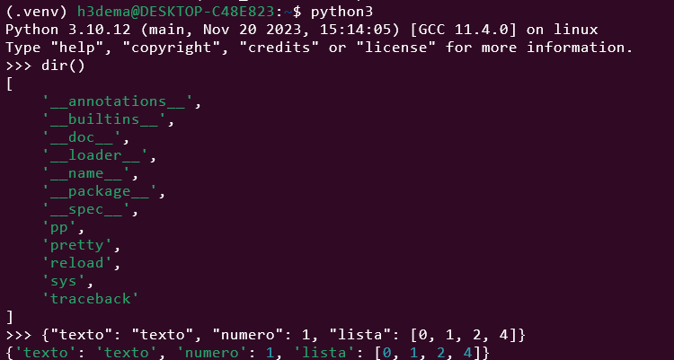

# Personalizando o interpretador Python (REPL)

O interpretador Python permite personalizar alguns de seus comportamentos e recursos no modo interativo. Para personalizar seu REPL, você pode usar um arquivo de inicialização, isto é, um arquivo Python que o interpretador lê e executa quando você inicia uma sessão interativa.

Você também pode usar a biblioteca Rich de terceiros para personalizar a saída de qualquer código executado em uma sessão REPL.


## Criando um arquivo de inicialização

O REPL padrão aceita um arquivo de inicialização que você pode usar para ajustar alguns recursos atuais ou adicionar novos recursos às suas sessões interativas. Este arquivo é executado apenas para sessões interativas. Ele não funciona quando você executa um programa com o comando python. Assim, você não precisa se preocupar em corromper programas importantes.

O arquivo de inicialização pode conter qualquer código Python. Este código será executado antes que o primeiro prompt seja exibido no modo interativo.

É importante destacar que o arquivo de inicialização é executado no mesmo namespace onde você executará seu código interativo. Assim, os objetos definidos ou importados neste arquivo estarão disponíveis na sua sessão interativa. Esse comportamento é útil quando você deseja carregar ferramentas e personalizar os recursos do seu shell interativo.

Antes de fazer algumas coisas legais com um arquivo de inicialização, você precisa aprender como informar ao interpretador qual arquivo você deseja usar como arquivo de inicialização. Você faz isso definindo a variável de ambiente PYTHONSTARTUP no shell do seu sistema.

Se você estiver no Linux você pode alterar o arquivo de configuração do shell que fica em sua pasta pessoal.
Altere o arquivo `~/.bashrc` acrescentando a seguinte linha (no final, por exemplo):

```
export PYTHONSTARTUP=~/.pythonstartup
```

Observe que o nome do arquivo não é importante. Você pode nomeá-lo como quiser. Você também pode colocar o arquivo em qualquer diretório que desejar. Apenas certifique-se de que sua variável de ambiente `PYTHONSTARTUP` contenha o caminho de arquivo correto.

## Melhorando o visual do seu REPL

Abra o arquivo em um editor de texto e prepare-se para adicionar algum código. Para começar com seu arquivo de inicialização personalizado, você começará adicionando algumas importações.
Como você já aprendeu, a função reload() permite recarregar módulos quando você modifica seu conteúdo para que você possa testar suas alterações. Ter esta função sempre disponível em suas sessões interativas será ótimo. Isso evitará trabalho repetitivo e economizará seu tempo.

A função pp() do módulo pprint permite imprimir estruturas de dados bem formatadas, como listas e dicionários.

A biblioteca Rich permite que você use rich text e formatação bonita no terminal. Rich 5.1.0 incluía uma bela impressão destacada. Você pode usar este recurso para colorir a saída do REPL padrão. No entanto, primeiro você precisa pip install Rich do PyPI, o índice do pacote Python, com o seguinte comando:

Com esta atualização no arquivo de inicialização do REPL, você replica o comportamento de coloração e formatação da saída em todas as sessões interativas com acesso à biblioteca Rich. Os blocos try… except… else garantem que seu arquivo de inicialização não gerará um erro se Rich não estiver disponível no ambiente Python que você está usando.

```
import sys
from importlib import reload
from pprint import pp

try:
    from rich import pretty, traceback
except ModuleNotFoundError:
    pass
else:
    pretty.install()
    traceback.install(show_locals=False)
```

